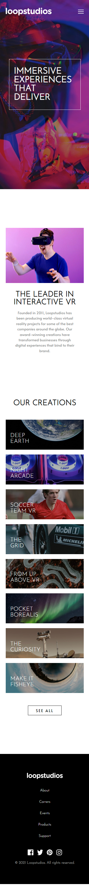

# Frontend Mentor - Loopstudios landing page solution

This is a solution to the [Loopstudios landing page challenge on Frontend Mentor](https://www.frontendmentor.io/challenges/loopstudios-landing-page-N88J5Onjw). Frontend Mentor challenges help you improve your coding skills by building realistic projects.

## Table of contents

- [Overview](#overview)
  - [The challenge](#the-challenge)
  - [Screenshot](#screenshot)
  - [Links](#links)
- [My process](#my-process)
  - [Built with](#built-with)
- [Author](#author)

## Overview

### The challenge

Users should be able to:

- View the optimal layout for the site depending on their device's screen size
- See hover states for all interactive elements on the page

<strong>The page is made only for the measures 375px and 1440px!</strong>

### Screenshot

### Links

- Solution URL: (https://github.com/eduviana/loopstudios-landing-page-main)
- Live Site URL: (https://loopstudios-landing-page-main-dfo1b44t0-eduviana.vercel.app/)

## My process

### Built with

- Semantic HTML5 markup
- SCSS custom properties
- Flexbox
- CSS Grid
- Mobile-first workflow
- [React](https://reactjs.org/) - JS library

## Author

- Github - (https://github.com/eduviana)
- Frontend Mentor - (https://www.frontendmentor.io/profile/eduviana)
